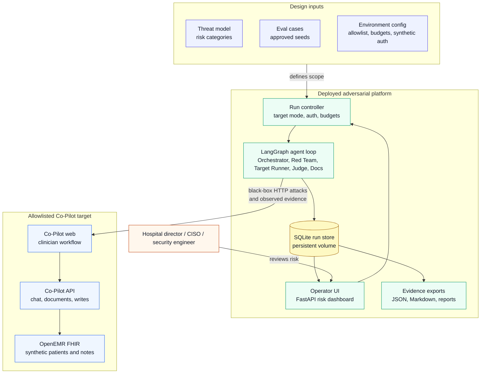

# Week 3 System Design Diagram

This is a simplified C4-inspired container view for the outside-in AgentForge adversarial AI security platform. It intentionally hides low-level internal edges so the first read answers three questions:

- Who uses the system?
- What is inside the adversarial platform?
- What external Co-Pilot target does it test?



## Design Readout

The system is an outside-in adversarial platform, deployed separately from Co-Pilot. It supports local and deployed target modes, but the operator app itself must be deployed for checkpoint and final review.

The simple container view is:

1. Design inputs define what is allowed and what matters: threat model, approved eval cases, target allowlist, budgets, and synthetic auth.
2. The deployed adversarial platform runs the operator UI, run controller, LangGraph agent loop, SQLite run store, and exports.
3. The platform attacks only the allowlisted Co-Pilot target through black-box HTTP workflows.
4. Co-Pilot returns observable evidence: responses, citations, timings, status codes, and tool outcomes.
5. The platform stores verdicts, traces, draft reports, confirmed reports, and regression artifacts in SQLite.
6. The operator UI presents a hospital-director risk view; exports provide submission evidence.

The detailed internal graph still exists conceptually:

```text
Orchestrator -> Red Team -> Target Runner -> Judge -> Documentation Draft -> Regression Store -> Orchestrator
```

That internal loop belongs in the deeper `W3_ARCHITECTURE.md`, not the first system-design diagram.
