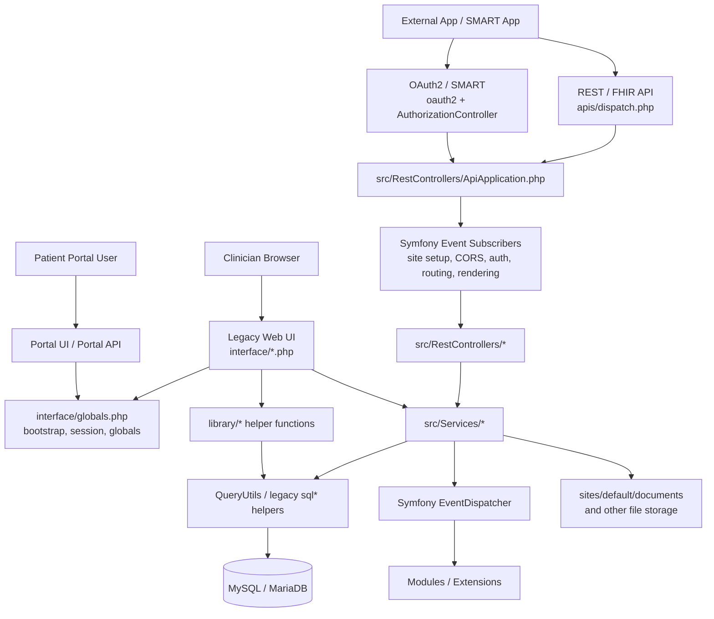
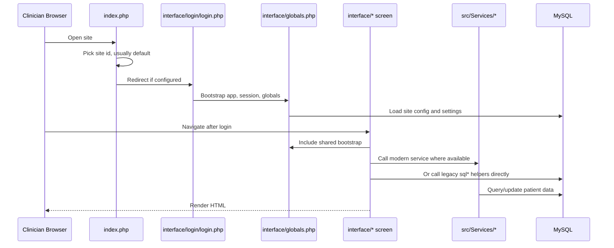
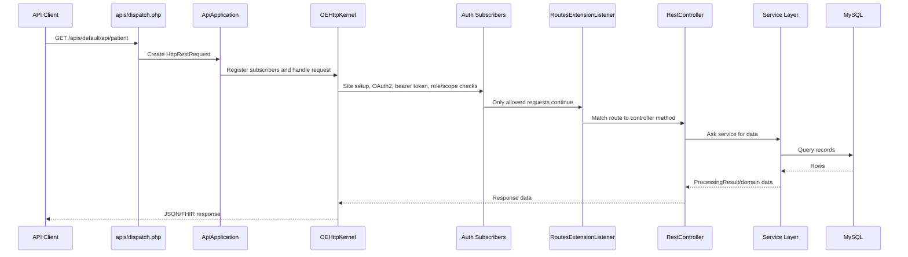
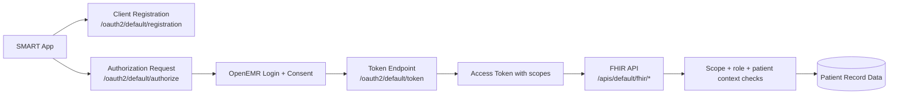
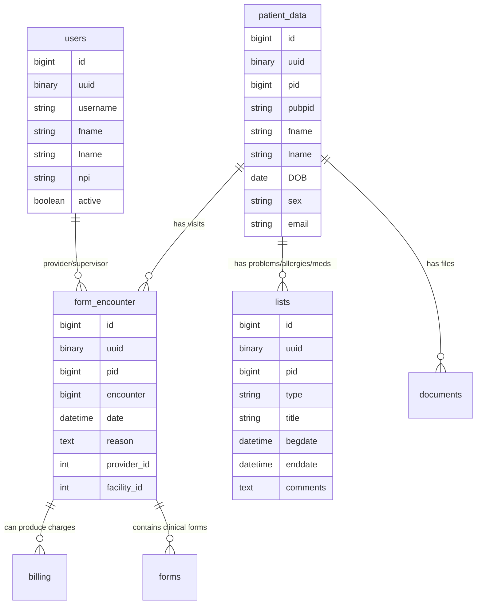
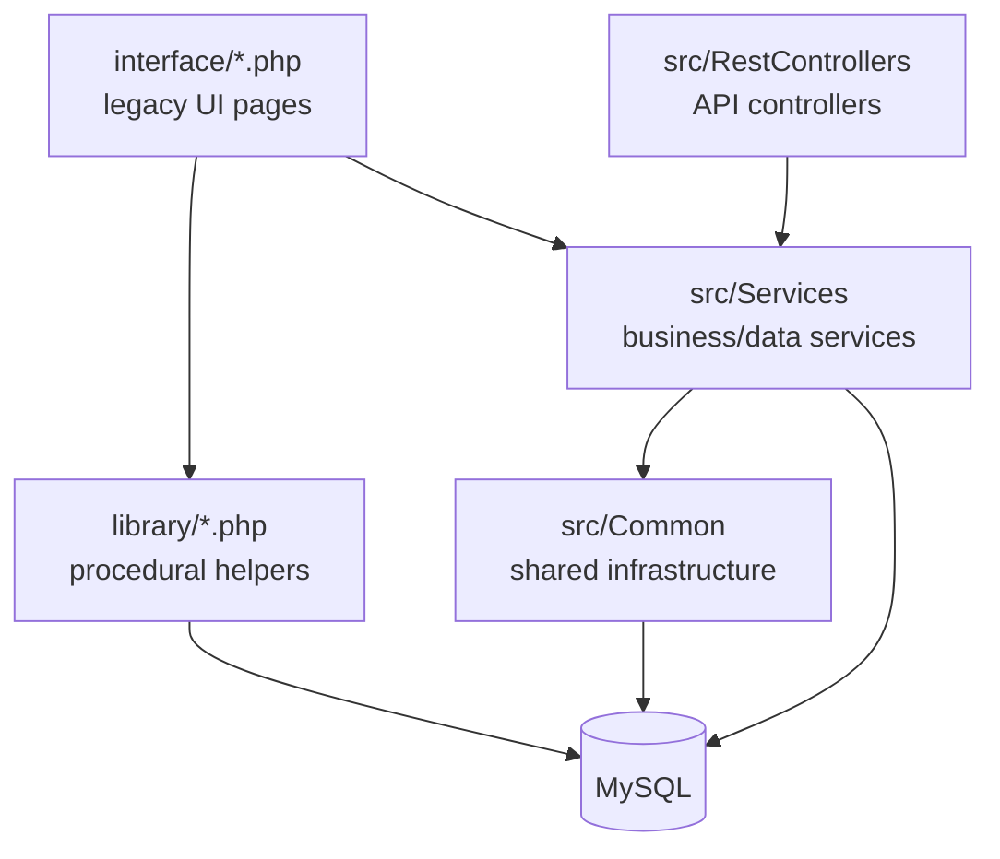
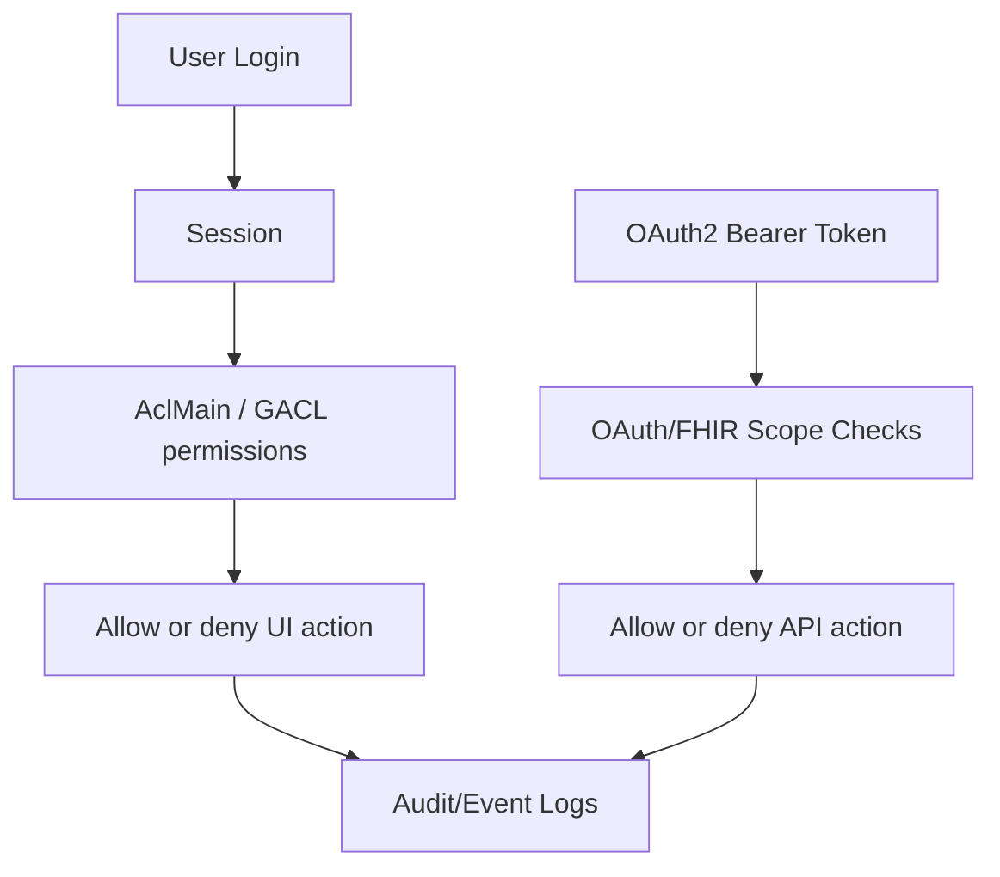
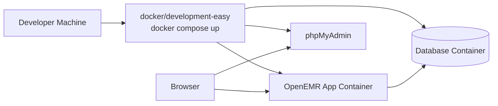
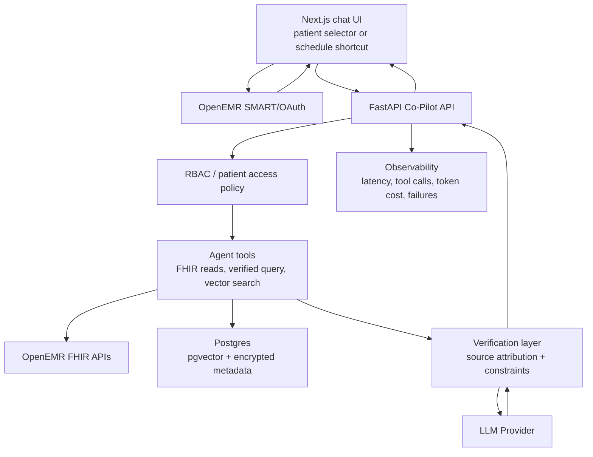

# OpenEMR ELI5: What This Repo Does and How It Works

This document explains the `moran-openemr` repository at a high level. It is written for a developer who needs to understand the product, the system design, and where to look before making changes.

## The One-Sentence Version

OpenEMR is an open-source electronic health record system: it helps a clinic store patient charts, schedule visits, record encounters, manage medications, bill insurance, expose clinical APIs, and enforce healthcare access rules around sensitive patient data.

## The ELI5 Version

Imagine a clinic as a big organized office.

- The **front desk** schedules patients, checks them in, and manages insurance.
- The **doctor** reviews the chart, writes notes, orders labs, updates medications, and signs records.
- The **billing team** turns visits into claims.
- The **patient portal** lets patients see and send limited information.
- The **API layer** lets approved outside apps talk to the clinic system.
- The **security system** decides who can see which patient data.

OpenEMR is the software version of that office. This repo contains the web app, database schema, APIs, old legacy screens, newer PHP services, templates, tests, Docker setup, and development tooling.

## Why This Repo Exists

OpenEMR exists because medical practices need an affordable, customizable EHR and practice management system. It is not a small SaaS app. It is a long-lived healthcare platform with years of accumulated clinical, administrative, billing, compliance, and integration needs.

That matters because the codebase is a hybrid:

- Some code is modern, namespaced PHP in `src/`.
- Some code is older procedural PHP in `interface/` and `library/`.
- Some workflows still depend on global state, sessions, and legacy helper functions.
- Newer API code uses Symfony-style request handling, event subscribers, OAuth2, FHIR, and services.

Do not assume every existing file is an example to copy. The repo's own developer guide says new work should prefer modern PHP patterns under `src/`.

## Product Areas

OpenEMR covers several large product areas:

| Product Area | What It Means | Where To Look |
|---|---|---|
| Patient charts | Demographics, history, documents, encounters, medications, problems, allergies | `interface/patient_file/`, `src/Patient/`, `src/Services/PatientService.php`, `sql/database.sql` |
| Scheduling | Calendar, appointments, tracking patients through visits | `interface/main/calendar/`, `src/Appointment/`, `src/Services/AppointmentService.php` |
| Encounters | The clinical visit record | `interface/forms/`, `src/Encounter/`, `src/Services/EncounterService.php`, `form_encounter` table |
| Billing | Claims, superbills, payments, insurance | `interface/billing/`, `src/Billing/`, `library/` billing helpers |
| Prescriptions and pharmacy | Medications, eRx-style flows, pharmacy data | `src/Rx/`, `src/Pharmacy/`, `interface/drugs/` |
| Reports | Clinical, financial, operational reporting | `interface/reports/`, `src/Reports/` |
| REST APIs | OpenEMR-specific JSON API | `apis/`, `apis/routes/`, `src/RestControllers/` |
| FHIR APIs | Healthcare-standard FHIR R4 API | `src/FHIR/`, `src/RestControllers/FHIR/`, `FHIR_README.md` |
| OAuth2 / SMART | Secure app integration and scopes | `oauth2/`, `src/RestControllers/AuthorizationController.php`, `src/RestControllers/SMART/` |
| Patient portal | Patient-facing access | `portal/`, `interface/patient_file/onsite_portal/`, `apis/routes/_rest_routes_portal.inc.php` |
| Modules | Optional extension system | `interface/modules/`, `custom/`, `src/Core/ModulesApplication.php` |

## Repo Map

```text
moran-openemr/
  index.php                 Entry point that chooses setup or login
  setup.php                 Installer/setup flow
  interface/                Main legacy web UI screens and controllers
  library/                  Legacy shared PHP functions/classes
  src/                      Modern namespaced PHP code under OpenEMR\
  apis/                     REST/FHIR API dispatch and route files
  oauth2/                   OAuth2 authorization entry point
  templates/                Twig, Smarty, and other templates
  public/                   Static assets and built frontend files
  sql/                      Main schema and version upgrade SQL scripts
  db/                       Doctrine migration support
  sites/                    Site-specific config and files; default tenant lives here
  docker/                   Production and development Docker setups
  tests/                    PHPUnit, API, service, isolated, E2E, and JS tests
  Documentation/            API docs, help files, EHI export docs, images
  composer.json             PHP dependencies, autoload, quality scripts
  package.json              Node/Gulp frontend build and JS/CSS tooling
```

## Big System Diagram



## How A Normal Web Request Works

The traditional OpenEMR UI is mostly PHP pages under `interface/`.



Important files:

- `index.php`: chooses the active site and redirects to login or setup.
- `interface/login/login.php`: login screen and setup for session/auth.
- `interface/globals.php`: central bootstrap for most legacy UI pages.
- `interface/main/main_screen.php`: main UI frame after login.

## How An API Request Works

The API path is more modern. Requests enter through `apis/dispatch.php`, then go through a Symfony-style HTTP kernel and event subscribers.



Important files:

- `apis/dispatch.php`: API entry point.
- `_rest_routes.inc.php`: loads standard, FHIR, and portal route maps.
- `apis/routes/_rest_routes_standard.inc.php`: standard REST API route map.
- `apis/routes/_rest_routes_fhir_r4_us_core_3_1_0.inc.php`: FHIR route map.
- `src/RestControllers/ApiApplication.php`: builds the API request pipeline.
- `src/RestControllers/Subscriber/*`: event subscribers for site setup, CORS, auth, routing, rendering, logging, telemetry.
- `src/RestControllers/*RestController.php`: API controllers.

## How OAuth2 / SMART Works

OAuth2 and SMART-on-FHIR exist so outside apps can securely access OpenEMR data with scopes.



The important idea: an external app should not just "get the database." It should receive a token with specific permissions, then API requests are checked against those permissions.

Important files:

- `oauth2/authorize.php`
- `src/RestControllers/AuthorizationController.php`
- `src/RestControllers/Subscriber/OAuth2AuthorizationListener.php`
- `src/RestControllers/Subscriber/AuthorizationListener.php`
- `src/FHIR/SMART/`

## Data Model: The Tables To Know First

OpenEMR has a large schema in `sql/database.sql`. Do not try to memorize it all. Start with these concepts:



Key tables:

- `patient_data`: patient demographics and identifiers.
- `users`: clinicians, staff, and system users.
- `form_encounter`: clinical visits/encounters.
- `lists`: a flexible clinical list table used for problems, allergies, and related patient items.
- `lists_medication`: medication-specific details linked to `lists`.
- `documents`: patient documents and uploaded files.
- `billing`: billing/coding records.
- `gacl_*`: access control data.
- `globals`: site-wide configuration.

## Modern Code vs Legacy Code

This repo has two worlds.

### Legacy World

The older code is mostly:

- `interface/*.php`
- `library/*.php`
- global variables like `$GLOBALS`
- helper functions like `sqlStatement()`, `sqlQuery()`, `sqlInsert()`
- PHP pages that both do business logic and render HTML

This code is important because much of the actual product still runs through it.

### Modern World

The newer code is mostly:

- `src/*`
- PHP namespaces under `OpenEMR\`
- Composer PSR-4 autoloading
- service classes like `PatientService`
- Symfony event dispatching and HTTP components
- OAuth2/FHIR controllers
- stricter typing in newer files

New work should usually start in the modern world and integrate carefully with the legacy world.



## The Service Layer

Services are where reusable business/data operations should live. Example: `src/Services/PatientService.php`.

Typical pattern:

1. Controller or UI code calls a service.
2. Service validates or normalizes input.
3. Service uses database helpers to read/write.
4. Service returns a result object or array.
5. Events may fire before/after changes.

`BaseService` gives common behavior such as:

- table field discovery
- insert/update column handling
- select helper patterns
- search helpers
- access to logging and events

This service layer is one of the best places to integrate new AI-supporting data access because it is closer to domain logic than raw SQL and easier to test than UI pages.

## Database Access

OpenEMR currently uses a mix of database access styles:

- Legacy ADODB-backed helpers such as `sqlStatement()`.
- `QueryUtils` wrapper methods in `src/Common/Database/QueryUtils.php`.
- Doctrine DBAL/ORM dependencies for newer or migration-related work.
- A compatibility connection factory in `src/BC/DatabaseConnectionFactory.php`.

The practical rule: use existing service and query utilities. Do not create random new database connections.

## Authentication and Authorization

OpenEMR has several layers of access control:



Important concepts:

- UI users authenticate into a session.
- Permissions are checked with ACL/GACL concepts such as `patients/demo`, `patients/med`, `admin/users`, etc.
- API clients use OAuth2 bearer tokens.
- FHIR requests are additionally constrained by SMART/FHIR scopes such as `patient/Patient.rs` or `user/Observation.crs`.
- Patient data is PHI, so auth, logs, and error handling are not optional details.

Important files:

- `src/Common/Acl/AclMain.php`
- `src/RestControllers/Subscriber/AuthorizationListener.php`
- `src/RestControllers/Subscriber/OAuth2AuthorizationListener.php`
- `src/RestControllers/AuthorizationController.php`

## Frontend and Assets

This is not a modern React app. It uses a mixture of:

- server-rendered PHP pages
- Twig templates
- Smarty templates
- jQuery
- AngularJS 1.x
- Bootstrap 4
- Gulp-built assets

Important files:

- `package.json`: Node dependencies and scripts.
- `gulpfile.js`: asset build pipeline.
- `public/`: built/static assets.
- `templates/`: templates.
- `interface/themes/`: theme-related UI code.

Build commands from `package.json`:

```bash
npm install
npm run build
npm run lint:js
npm run stylelint
npm run test:js
```

Note: `npm test` intentionally fails with "no test specified"; use `npm run test:js`.

## Development Environment

The recommended local development path is Docker.



From `CLAUDE.md`, the quick start is:

```bash
cd docker/development-easy
docker compose up --detach --wait
```

Expected local URLs:

- App: `http://localhost:8300/` or `https://localhost:9300/`
- Login: `admin` / `pass`
- phpMyAdmin: `http://localhost:8310/`

## Testing and Quality Gates

OpenEMR has a serious quality toolchain.

PHP-side commands from `composer.json`:

```bash
composer checks
composer code-quality
composer phpunit-isolated
composer phpstan
composer phpcs
composer rector-check
composer require-checker
composer php-syntax-check
composer codespell
```

Docker/devtools commands from `CLAUDE.md`:

```bash
docker compose exec openemr /root/devtools clean-sweep-tests
docker compose exec openemr /root/devtools unit-test
docker compose exec openemr /root/devtools api-test
docker compose exec openemr /root/devtools e2e-test
docker compose exec openemr /root/devtools services-test
```

JS/CSS commands:

```bash
npm run lint:js
npm run test:js
npm run stylelint
```

Test directories:

- `tests/Tests/Api`: API controller tests.
- `tests/Tests/Common`: shared component tests.
- `tests/Tests/E2e`: browser tests.
- `tests/Tests/Fixture`: test fixtures.
- `tests/Tests/Isolated`: tests that run without Docker/database.
- `tests/Tests/Service`: service/data access tests.
- `tests/Tests/Unit`: unit tests.
- `tests/js`: JavaScript tests.

For a small docs-only change, tests may not be needed. For code changes, choose the narrowest relevant tests first, then run broader checks before merge.

## Security and Compliance Design

Because this is healthcare software, the security model matters more than in a normal CRUD app.

Design concerns:

- PHI must not leak through logs, error messages, or external APIs.
- Users should only see patient data they are authorized to see.
- API tokens must be scoped.
- Clinical claims should be traceable to source records.
- Audit logs matter because clinical systems need accountability.
- TLS/HTTPS matters because patient data is sensitive in transit.
- Multi-site support means "which site/tenant is this request for?" is part of request handling.

OpenEMR already has security machinery, but an AI feature must plug into it rather than bypass it.

## How This Maps To AgentForge

The current AgentForge MVP architecture uses a standalone Clinical Co-Pilot connected to OpenEMR. The most important interpretation is:

> The AI agent should not be a general medical chatbot or an independent clinical database. It should be a controlled assistant that retrieves allowed patient facts from OpenEMR, verifies claims against those facts, and returns a concise, source-grounded answer to a clinical user.

### Likely Integration Points



Good first places to investigate for the agent:

- Patient context: `src/Services/PatientService.php`, `patient_data`.
- Encounters: `src/Services/EncounterService.php`, `form_encounter`.
- Medications/problems/allergies: `lists`, `lists_medication`, related services.
- App/API authorization: `AuthorizationListener`, `AclMain`, OAuth/FHIR scopes.
- Co-Pilot UI/API: standalone Next.js app plus FastAPI service.
- Audit/telemetry: Co-Pilot-owned metadata logging, with OpenEMR API logging configured to avoid response-body PHI.

### Clinical Co-Pilot Design Rule

The agent should answer like this:

1. Get the current user and patient context.
2. Check whether the user is allowed to access that patient/data category.
3. Use tools to retrieve specific record slices.
4. Generate a response only from retrieved data.
5. Verify every clinical claim has a source.
6. Show citations/source labels.
7. Log tool calls, latency, failures, and cost without logging raw PHI unnecessarily.
8. Refuse or degrade gracefully when records are missing or access is denied.

## What To Read First

Read in this order:

1. `README.md`: product overview.
2. `CLAUDE.md`: best developer guide in this repo.
3. `CONTRIBUTING.md`: setup and contribution workflow.
4. `DOCKER_README.md`: local/deployment Docker model.
5. `API_README.md`: API overview.
6. `FHIR_README.md`: FHIR and SMART-on-FHIR overview.
7. `composer.json`: PHP scripts, dependencies, autoloading.
8. `package.json`: frontend scripts and dependencies.
9. `apis/dispatch.php` and `src/RestControllers/ApiApplication.php`: API request flow.
10. `interface/globals.php`: legacy UI bootstrap.
11. `src/Services/PatientService.php`: example of a domain service.
12. `sql/database.sql`: database shape.

## How To Explore Without Getting Lost

Use feature-first exploration.

Example: "How does patient search work?"

1. Search routes for `patient`.
2. Open `PatientRestController`.
3. Follow calls into `PatientService`.
4. Follow database tables such as `patient_data`.
5. Check tests under `tests/Tests/Api`, `tests/Tests/Service`, or `tests/Tests/Unit`.
6. Check UI screens under `interface/patient_file/`.

Example: "How is API auth enforced?"

1. Start at `apis/dispatch.php`.
2. Open `ApiApplication`.
3. Read `AuthorizationListener`.
4. Read `OAuth2AuthorizationListener`.
5. Check route maps and scope requirements.
6. Check FHIR docs under `Documentation/api/`.

## Common Gotchas

- There are many old patterns. Do not copy legacy global-state style into new code unless there is no practical alternative.
- `interface/globals.php` does a lot. It is bootstrap, compatibility, config, session setup, and security setup.
- The app supports multiple sites/tenants through `sites/<site_id>`.
- The database schema is huge and old. Start with the tables relevant to your feature.
- API and UI paths may implement similar concepts differently.
- FHIR resources are not one-to-one table wrappers; they translate OpenEMR data into healthcare-standard resources.
- Tests may require Docker unless they are isolated tests.
- Healthcare data changes require more caution than normal CRUD changes because wrong answers can affect patient care.

## Practical Mental Model For New Work

When adding a feature, ask:

1. Who is the user: clinician, admin, patient, external app, or system process?
2. What patient/site context is active?
3. What permission or scope allows this action?
4. Which service already owns this data?
5. Which table stores the source of truth?
6. Is there an existing UI, API, FHIR, or module pattern to follow?
7. What test proves the behavior?
8. What audit/logging is needed?
9. Could this leak PHI?
10. Does this need to be source-attributed for clinical trust?

## Short Glossary

- **EHR/EMR**: Electronic health/medical record.
- **PHI**: Protected Health Information.
- **FHIR**: Healthcare data API standard.
- **SMART-on-FHIR**: OAuth-based app launch and authorization standard for healthcare apps.
- **Encounter**: A clinical visit or interaction.
- **ACL/GACL**: Access control system deciding what users can do.
- **Site**: OpenEMR's tenant/config context, usually `default`.
- **Service**: A reusable PHP class for business/data operations.
- **Route map**: File that connects URL paths to controller methods.
- **Module**: Optional extension loaded into OpenEMR.

## Bottom Line

OpenEMR is a large healthcare platform, not a small app. The safest way to work in it is to trace one workflow end to end: entry point, auth, controller/UI, service, database, tests, and logs. For the Clinical Co-Pilot project, the most important design principle is to use OpenEMR as the source of truth and permission boundary, then add AI as a controlled, verified layer on top.
